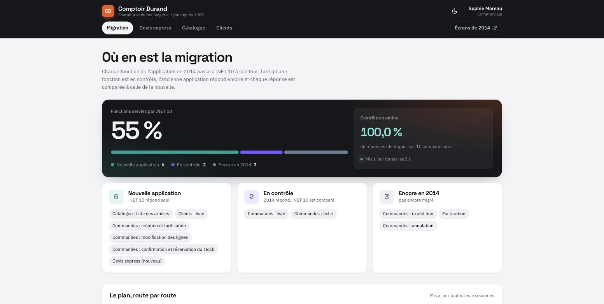
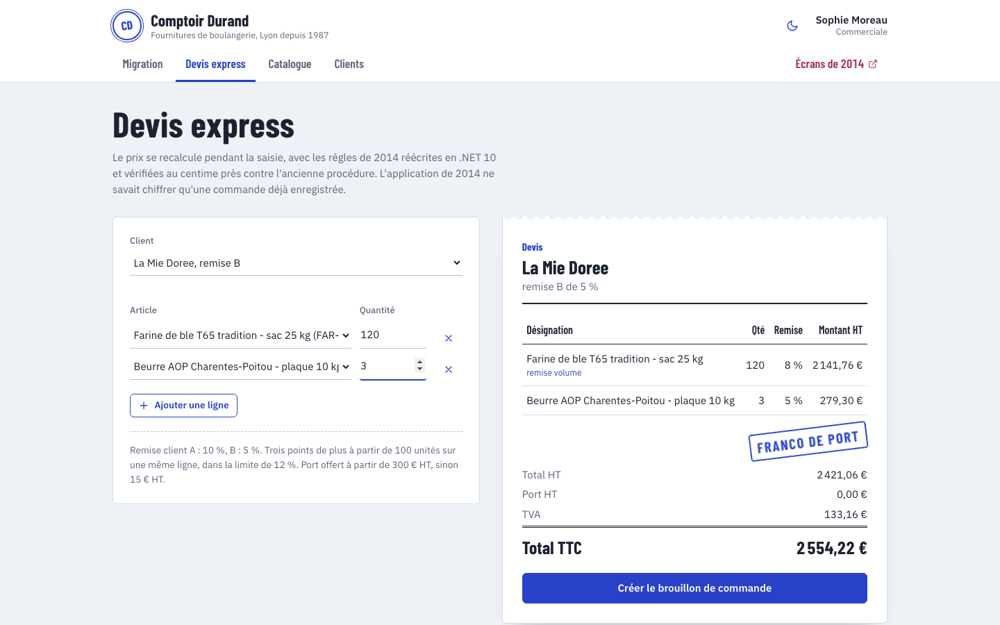
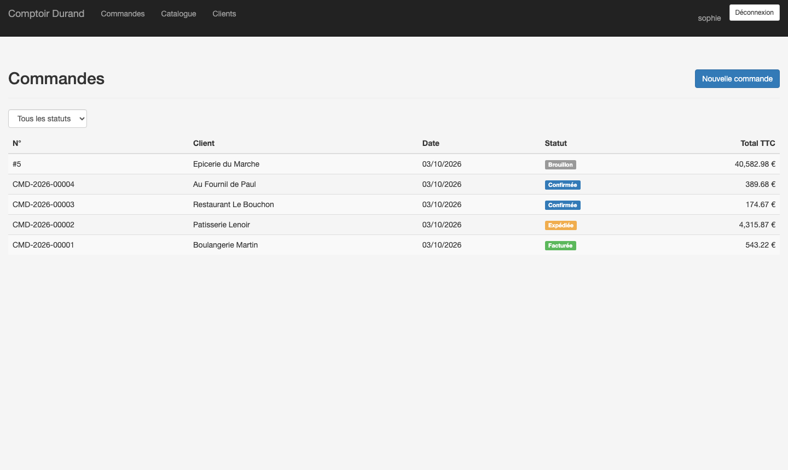
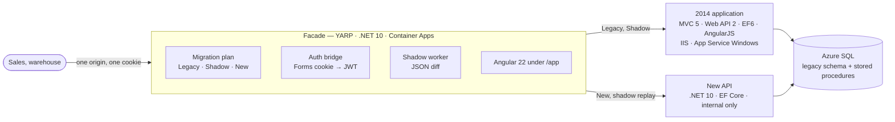

<div align="center">

# Comptoir

**Migrating a 2014 .NET Framework application to .NET 10 + Angular — without a rewrite**

A wholesaler's order system (ASP.NET MVC 5, Web API 2, EF6, AngularJS, business rules in stored procedures) migrated
route by route behind a YARP facade, with the new pricing **proven equal to the legacy stored procedure** by
differential tests and every switch backed by shadow traffic.

[**▶ Live demo**](https://comptoir.jassbr.me/app/) · [Architecture decisions](docs/adr/README.md) · [Français](#-en-français)

[](https://github.com/JASSBR/comptoir/actions/workflows/ci.yml)
[](https://github.com/JASSBR/comptoir/actions/workflows/codeql.yml)


[](LICENSE)



<table>
  <tr>
    <td width="50%"></td>
    <td width="50%"></td>
  </tr>
  <tr>
    <td align="center"><sub>New: an express quote the legacy could not do</sub></td>
    <td align="center"><sub>The 2014 screens, unchanged, now partly answered by .NET 10</sub></td>
  </tr>
</table>

</div>

## Try it in 3 minutes

1. Open the [demo](https://comptoir.jassbr.me/) and sign in on the **2014 login page** as `sophie` / `comptoir-demo`.
2. You are in the AngularJS application. Open the orders, open one: these reads are in **shadow** mode — the legacy
   answers, and the facade replays them on the new API and compares.
3. Open [`/app/migration`](https://comptoir.jassbr.me/app/migration) (same session, no second login): the plan route by route, and the
   comparisons you just generated, identical or with the JSON path that differs.
4. Open the **express quote**: choose a customer and 120 sacks of flour — volume discount, free-shipping threshold and
   VAT are computed live by the .NET port. Create the draft: it opens **in the 2014 screen**, which can confirm it
   (new code), ship and invoice it (legacy stored procedures), on the same database.

> Everything runs on free tiers that sleep: the first request after a quiet period can take 20–40 seconds.

## What a reviewer should look at

| If you care about… | Look at |
|---|---|
| **Proving behaviour is preserved** | [`PricingParityTests`](tests/Comptoir.DifferentialTests/PricingParityTests.cs): random orders priced by the stored procedure on SQL Server and by the port, equal to the cent, mutation-checked — [ADR 0004](docs/adr/0004-pricing-parity-by-differential-testing.md) |
| **Incremental migration** | [`Comptoir.Facade`](src/Comptoir.Facade): per-route `Legacy` / `Shadow` / `New` modes from configuration — [ADR 0001](docs/adr/0001-strangler-fig-not-rewrite.md) |
| **Evidence before switching** | Shadow replay with semantic JSON diff, bounded queue, live dashboard — [ADR 0006](docs/adr/0006-shadow-traffic-before-switching.md) |
| **Two systems, one database** | The confirmation port keeps the procedure's lock hints; tested by legacy and new confirmations racing — [ADR 0003](docs/adr/0003-shared-database-during-transition.md) |
| **Identity during a migration** | Forms cookie → 5-minute JWT at the facade, legacy cookie stripped — [ADR 0005](docs/adr/0005-auth-bridge-at-the-facade.md) |
| **Not breaking the old UI** | The new API reproduces the Web API 2 contract, error shapes included — [ADR 0007](docs/adr/0007-same-contract-first.md) |
| **Respect for the legacy** | Untouched except one endpoint; built on Windows in CI with every Razor view precompiled — [ADR 0002](docs/adr/0002-legacy-left-untouched.md) |
| **Hosting** | IIS on App Service Windows, Azure SQL free offer, Container Apps, all Terraform — [ADR 0008](docs/adr/0008-hosting-and-local-development.md) |

## Architecture



```
legacy/
  Comptoir.Web/            the 2014 application (net48): MVC 5, Web API 2, EF6, AngularJS 1.8 — left as it is
  Database/                schema, stored procedures (pricing, stock, numbering), demo data — still the schema's owner
src/
  Comptoir.DbMigrator/     DbUp: replays legacy/Database in deployments and tests
  Comptoir.Domain/         pricing and stock rules ported from the procedures (pure C#)
  Comptoir.Api/            .NET 10 API: legacy contract on legacy tables, plus /api/v2
  Comptoir.Facade/         YARP: migration plan, auth bridge, shadow traffic, serves /app
  Comptoir.AppHost/        Aspire: facade + API + Angular dev server locally
tests/                     differential (vs stored procedures) · API on SQL Server · facade
web/                       Angular 22: migration dashboard, express quote, catalogue
deploy/terraform           App Service Windows, Azure SQL (free), Container Apps
```

## Run it

Prerequisites: .NET SDK 10, Node 24, Docker. The legacy itself needs Windows (CI builds it there); locally the
facade talks to the integration legacy — see [ADR 0008](docs/adr/0008-hosting-and-local-development.md).

```bash
dotnet test --solution Comptoir.slnx          # differential + API + facade tests (SQL Server in Docker)
dotnet run --project src/Comptoir.AppHost     # facade + API + Angular, against the integration legacy (user secrets)
./deploy/azure.sh                             # everything to Azure (Terraform)
```

## Quality gates

| Gate | |
|---|---|
| Legacy | MSBuild on **Windows**, every Razor view precompiled, IIS package as artifact |
| New side | analyzers with warnings as errors, `dotnet format`, tests on real SQL Server with the legacy procedures, coverage gate 80 % |
| Frontend | Prettier, ESLint (OnPush), Vitest with thresholds (98 % statements) |
| Delivery | both container images built, `terraform validate`, CodeQL, Dependabot (legacy excluded on purpose) |

## 🇫🇷 En français

Comptoir montre la migration d'une application de gestion commerciale de 2014 (.NET Framework 4.8, ASP.NET MVC 5,
Web API 2, EF6, AngularJS, règles métier en procédures stockées) vers .NET 10 et Angular 22, **sans réécriture** :
une façade YARP bascule les fonctions une par une, la nouvelle tarification est **prouvée identique** à la procédure
stockée par des tests différentiels, chaque bascule est précédée de trafic en ombre, et les deux applications
partagent la base pendant la transition. [Essayer la démo](https://comptoir.jassbr.me/).
